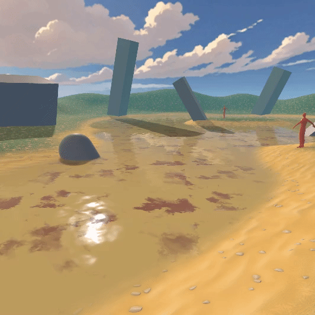
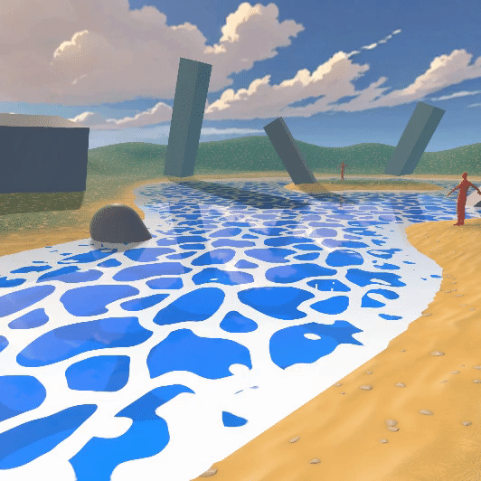

# 🌊 Uber Stylized Water

A highly customizable open-source stylized water shader for Unity 6.

---

## How to use

[See the full Guide ↗](https://matrixrex.github.io/Uber-Stylized-Water/#/usage-guide/Usage-Guide)

## Inspiration 💡

- [Stylized water tutorial](https://ameye.dev/notes/stylized-water-shader/) by [Alex Ameye](https://x.com/alexanderameye)

[And Special Thanks to...](special-thanks.md)

## Compatibility

Unity 6 (6000.0.30)+

Pipeline:
URP ✅
HDRP ⛔
Buit-In ⛔

Rendering Path : Forward, Forward+, Deferred

## 🌟 Key Features

### 💧 Water Surface & Transparency

- **Fully opaque or transparent water** creation.
- **Surface foam** with distortion motion.
- **Insertion foam** for immersive interactions with objects.
- **World-space UV** ensures water seamlessly connect across multiple meshes.

### 🌊 Shoreline & Depth Details

- Animated **shoreline effects**.
- HDR **deep and shallow colors**.
- Customizable **shadow color + opacity**

### ✨ Advanced Layers & Effects

- **Surface foam underwater layer** with seperate color control.
- **Projected caustics** with no extra components required.
- Underwater **refraction**.

### 💡 Lighting & Reflections

- Adjustable **light specular controls**, including size, spread, hardness, and color.
- Integrated **local planar reflection probe**, blending seamlessly with Unity’s reflection probes.

### 🌊 Wave

- World-space **Gerstner waves**
- **Wave peak** color.

## 🎉 Showcase

All the showcase templates are included.

