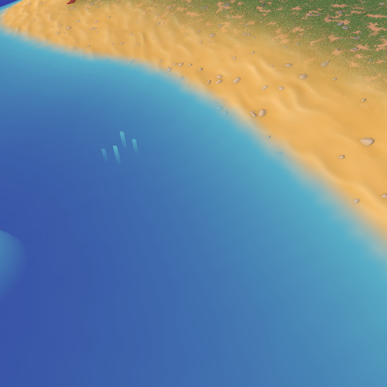
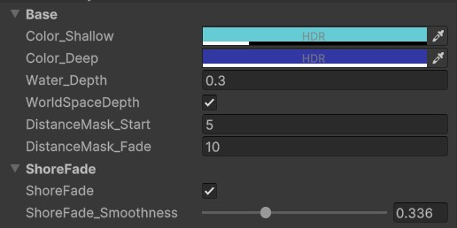
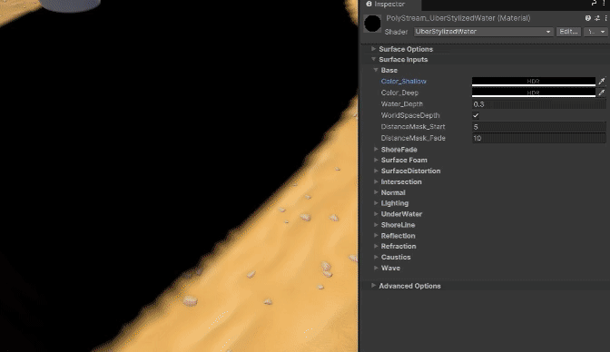
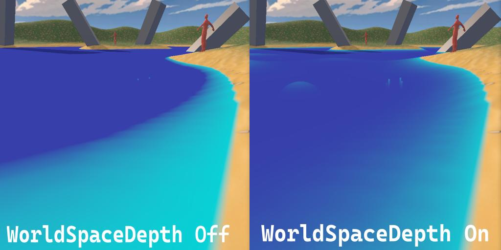
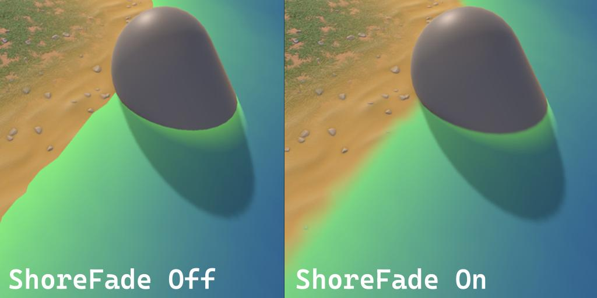

# Base and Shore fade Settings

This section controls the base water color, depth calculation, and shore fade settings.

---

## Unique Parameters

### Color

`Color_Shallow` and `Color_Deep` Controls base water color. The alpha value also controls water opacity. This is unique to base colors as they directly affect the water opacity. In most cases, color alpha will only affect that specific water layer.

These color regions are detertmined by the `Water_Depth` parameter.

### World Space depth

`WorldSpaceDepth` enables depth calculation in **world space**. Disable this to use the **Screen Space** depth method instead. Screen Space depth changes with the camera rotation, while world space depth doesn't.

### Shore fade

**'ShoreFade'** Fades the water line near geometry intersection. This opacity is applied over every layer, and insn't affected by any other layer.

---
