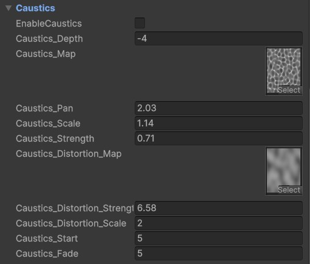

# Caustics Settings

The **Caustics Effect** adds animated light patterns typically seen in shallow water, enhancing underwater visuals.

---

## Unique Parameters

---

### **Caustic Texture**

- **`Caustics_Map`**:  
  A texture is required in this slot for the caustics effect to function.

---

### **Dual Sampling**

- **Dual Sampling Technique**:  
  Similar to the normal map, the caustics texture uses dual sampling to reduce linear motion and create more natural movement.

---

### **Distortion**

- **`Caustic_DistortionMap`**:  
  An optional distortion texture that adds dynamic warping to the caustics. Without this map, the effect will still work. It adds more dynamic motion to the caustics.

---

### **Range and Fade**

- **`Caustics_Start`**:  
  Controls the distance from the camera where the caustics effect begins.
- **`Caustics_Fade`**:  
  Adjusts the smoothness of the caustics fade-out effect, ensuring a seamless transition.

---

### **Projection on Geometry**

- **Geometry Interaction**:  
  The caustics effect project onto the underwater geometry.

---
