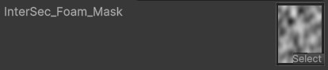
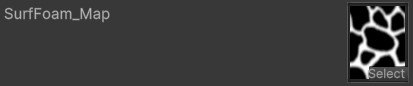
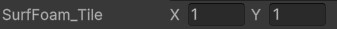
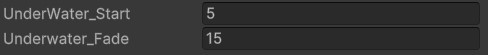
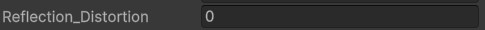

# General Settings

The **Uber Stylized Water Shader** includes a set of common parameter types used throughout its features. These parameters won't be explained repeatedly in later sections, so this is your go-to reference for understanding them.

---

## Key Concepts

This shader applies **features in a layer-like fashion**, with each feature adding a new visual layer to the base water. Understanding how these parameters work is essential for fine-tuning the shader.

---

## Common Parameter Types

### **Feature Toggle**

- **Enable\_(Feature)**:
  Toggles the feature on or off.

  

---

### **Color and Strength**

- **(Feature)\_Color**:
  Defines the color of the feature. The alpha channel typically adjusts the strength or opacity of the feature.

  

---

### **Mask and Map Textures**

- **(Feature)\_Mask**:
  (Optional) A texture slot used to mask specific areas where the feature will appear.

  

- **(Feature)\_Map**:
  (Required) A texture slot that defines the main pattern or texture for the feature.

  

  - **Invert\_(Feature)**:
    Inverts the mask texture of the feature.

  

---

### **Texture Transformation**

- **Feature_Pan**:  
  Controls the movement of the feature. Adjust **X** and **Y** fields to set speed in each direction.

  

- **Feature_Scale**:  
  Resizes the texture pattern for the feature.

  

- **Feature_Tile**:  
  Sets independent tiling values for the **X** and **Y** axes. This is typically kept at a 1:1 ratio.

  

---

### **Transition Controls**

- **Feature_Start/End**:  
  Defines the start and end position or range of the feature.
- **Feature_Fade/Smoothness**:  
  Adjusts the smoothness of transitions or blending for the feature.

  

---

### **Effect Strength**

- **Feature_Strength**:  
  Increases or decreases the overall intensity of the feature.

  
- **Feature_Depth** (For underwater effects):  
  Specifies how far below the water surface the feature appears. Values are in negetive.

  

---

### **Distortion**

- **Feature_Distortion**:  
  Sets the strength of distortion, often influenced by the normal map.

  

---

## Notes

- We will go through each of the unique paremeters in the next sections.

---

Keep this reference handy as you dive deeper into the shader's customization options!
