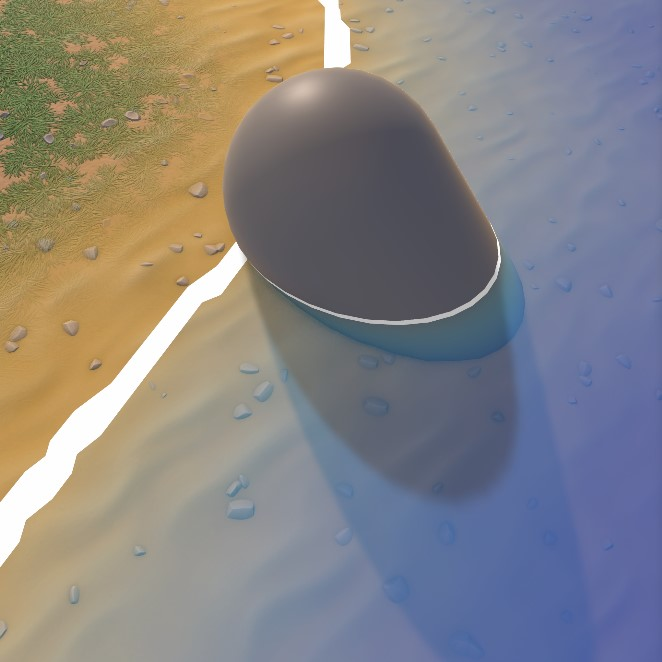

# Intersection Foam Settings

This effect creates a foam effect on the intersection between water and other objects.

---

## Unique Parameters

---

### **Foam Type**

Intersection foam can be used with or without a mask texture.

- Without a mask: The foam appears as a clean line following the intersection.
- With a mask: Setting `InterSec_Dissolve` to **0** achieves the same clean line effect.

  

---

### **Foam Width**

- **`InterSec_Width`**:  
  Controls the width of the intersection foam.

---

### **Foam Distortion**

- The foam texture can inherit distortions from the **Surface Distortion** [See: [Surface Foam and Distortion Settings](usage-guide/shader-properties/shader-prop-SurfacefoamDistortion.md#2-surface-distortion)].
- **`InterSec_Foam_Distortion`**:  
  Adjusts the strength of the distortion effect.

---

### **Foam Dissolve**

- **`InterSec_Foam_Smooth`**:  
  Determines how smooth or sharp the dissolve effect is.
- **`InterSec_GradientDissolve`**:  
  Adds a gradient-based dissolve effect:

  - **Enabled**: Dissolve is less noticeable closer to the intersection, becoming more apparent further away.
  - **Disabled**: Dissolve is applied evenly across the foam.

    

### **Edge Fading**

- **`InterSec_Edge_Fade`**:  
  Fades the foam's outer edge by reducing its alpha value:

  - **Closer to the intersection**: Full alpha.
  - **Further from the intersection**: Lower alpha for a fading effect.

    

---
