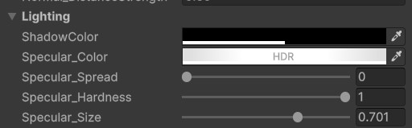
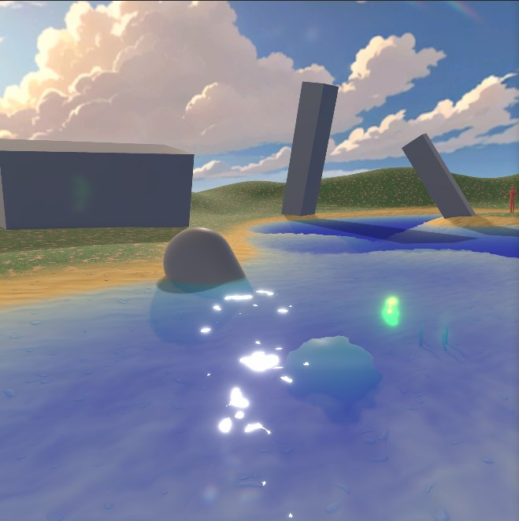

# Lighting Settings

This settings controls shadow settings and specular highlight settings. This shader employs **Phong shading** instead of physically-based rendering (PBR) to optimize performance and provide greater artistic control over the water's appearance.

---

## Unique Parameters

### **Shadow Control**

- **`Shadow_Color`**:  
  Adjusts the color and intensity of shadows cast on the water surface.

---

### **Light Coloring**

- Main light color changes are **not supported**. However, **additional lights** can be colored.

  

---

### **Specular Highlights**

1. **Specular Color**  
   Controls the color of the specular highlights on the water surface. However. this overwrites any light color.
   Specular brightness can be adjusted from the HDR intensity slider. With high value you can create fantasy like sparking water. Or make it zero to remove specular highlights.

2. **Specular Spread**

   - Diffuses the specular highlight across the water's surface.
   - A value of **0** gives a focused highlight.
   - Higher values result in softer, broader highlights.

3. **Specular Hardness**

   - Blends between soft and hard specular highlight edges.

4. **Specular Size**

   - Functions only when **Specular Hardness** is greater than **0**.
   - Controls the size of the hard highlight.

5. **Specular Distortion**
   - The specular distortion is affected by the [Normal map](usage-guide/shader-properties/shader-prop-normal.md) strength.

---
