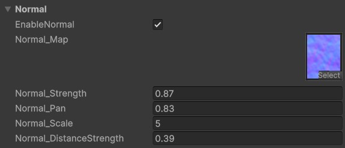

# Normal Map Settings

The **Normal Map** introduces surface details to the water shader, to fake micro waves, adding realism to reflections, refractions, and lighting. However, it doesn't directly affect the shader unless applied in specific sections like [Lighting](usage-guide/shader-properties/shader-prop-lighting.md), [Reflection](usage-guide/shader-properties/shader-prop-reflection.md), or [Refraction](usage-guide/shader-properties/shader-prop-refraction.md).

---

## **Dual Sampling**

- Unlike standard mask textures, the **Normal Map** is sampled **twice** from opposite directions.
  - This technique breaks linear motion in one direction, resulting in more natural wave patterns.
  - Because of this, `Normal_Pan` is limited to a **single value** (uniform panning speed).

---

## Unique Parameters

### **Strength Adjustments**

- **`Normal_Strength`**:  
  Defines the intensity of the normal map **close to the camera**.
- **`Normal_DistanceStrength`**:  
  Controls the intensity of the normal map **in the distance**. This setting reduces noise in far-away water, creating a more visually pleasing and less distracting result.
  - The transition distance is defined in the **[Base Settings](usage-guide/shader-properties/shader-prop-base.md)** `Distance_Mask` parameter.

---

## Usage

- See the [Lighting](usage-guide/shader-properties/shader-prop-lighting.md), [Reflection](usage-guide/shader-properties/shader-prop-reflection.md), [Refraction](usage-guide/shader-properties/shader-prop-refraction.md) Settings for how Normal map affects them.

---
