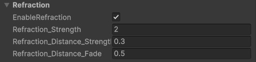

# Refraction Settings

Refraction creates the illusion of light bending through water, distorting the geometry beneath the surface.

---

## Unique Parameters

---

### **Refraction Distortion**

- The distortion is calculated based on the **water surface normals**, which simulate light bending across the ripples and waves.
- **Important Note**: The **Normal Strength** parameter does **not** affect refraction distortion.

### **Refraction Strength**

- **`Refraction_Strength`**:  
  Controls the intensity of the refraction effect.
  - Higher values increase the bending of light, creating a stronger distortion effect.

---

### **Distance-Based Refraction**

- Refraction intensity can be adjusted based on viewing distance:
  - **`Refraction_Distance_Strength`**:  
    Determines the refraction strength applied at greater distances.
  - **`Refraction_Distance_Fade`**:  
    Controls how quickly the refraction fades as distance increases.

This separation allows for precise control of distortion without affecting **Specular Highlights** or **Reflection Distortion**.
