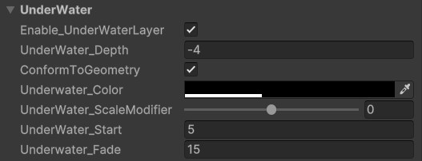
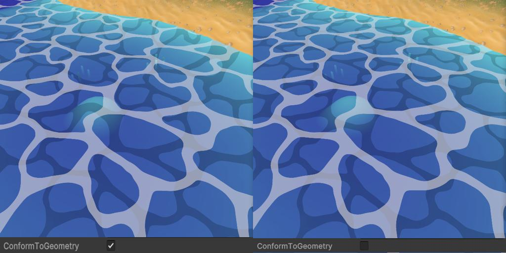

# Underwater Settings

The **Underwater Layer Effect** adds a secondary foam-like layer beneath the water surface. This effect can be used to simulate foam shadows or create additional layers of foam for a more dynamic look.

---

## Prerequisites

- The underwater effect is only visible when **Surface Foam** or **Intersection Foam** is enabled.
- The layer repeats the foam texture underneath the water surface.
- Foam distortion and motion are directly influenced by the settings in the **Surface Foam** or **Intersection Foam** sections.

---

## Unique Parameters

### **Conform to Geometry**

- **`ConformToGeometry`**:  
  Toggles whether the underwater layer conforms to the underwater geometry or maintains a fixed distance from the water surface.
  - **Enabled**: The layer adheres to the underwater geometry.
  - **Disabled**: The layer stays parallel to the water surface.

### **Scale Modifier**

- **`UnderWater_ScaleModifier`**:  
  Adjusts the size of the underwater layer relative to the water surface.
  - `0`: Matches the water surface size.
  - `1`: Doubles the size of the water surface.
  - `-1`: Halves the size of the water surface.

---

### **Distance and Transition**

- **`UnderWater_Start`**:  
  Sets the starting distance from the camera at which the underwater layer becomes in-visible.
- **`UnderWater_Fade`**:  
  Controls the smoothness of the transition for the underwater layer's visibility.

---
