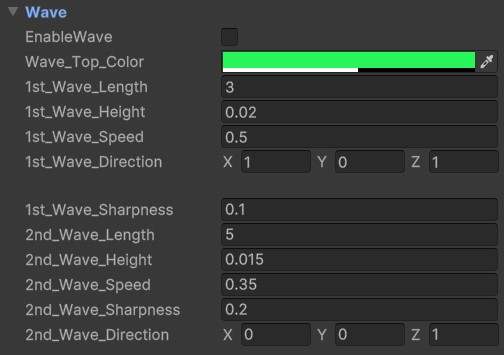

# Wave Settings

The **Wave Settings** in this shader implement the **Gerstner Wave Formula**, allowing the simulation of realistic water surface motion. The shader supports two individually controllable waves for added complexity and detail.

---

## Unique Parameters

### **Wave Dimensions**

- **`Wave_Length`**:  
  Defines the distance between wave peaks. Longer wave lengths result in smoother, more spaced-out waves.
- **`Wave_Height`**:  
  Controls the height of the wave in meters. Since water waves are usually subtle, this value is often very small.

---

### **Wave Motion**

- **`Wave_Speed`**:  
  Determines the movement speed of the waves. Increasing this value creates faster-moving water surfaces.
- **`Wave_Direction`**:  
  A vector that dictates the movement direction of the wave. Modify the **X** and **Z** components to orient the wave in the desired direction.

---
