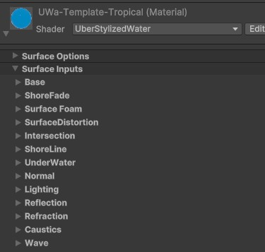

# Shader properties

Guide of how to use the provided shader to achive your desired look.

The shaders is spereated in these sub-sections:

- [General settings](usage-guide/shader-properties/shader-prop-general.md)

- [Base and shore fade](usage-guide/shader-properties/shader-prop-base.md)

- [Surface foam and distortion](usage-guide/shader-properties/shader-prop-SurfacefoamDistortion.md)

- [Intersection foam ](usage-guide/shader-properties/shader-prop-intersection.md)

- [Shoreline effect ](usage-guide/shader-properties/shader-prop-shoreline.md)

- [Underwater layer ](usage-guide/shader-properties/shader-prop-underwater.md)

- [Normal map ](usage-guide/shader-properties/shader-prop-normal.md)

- [Lighting ](usage-guide/shader-properties/shader-prop-lighting.md)

- [Reflection ](usage-guide/shader-properties/shader-prop-reflection.md)

- [Refraction ](usage-guide/shader-properties/shader-prop-refraction.md)

- [Caustics ](usage-guide/shader-properties/shader-prop-caustics.md)

- [Wave ](usage-guide/shader-properties/shader-prop-wave.md)

---
